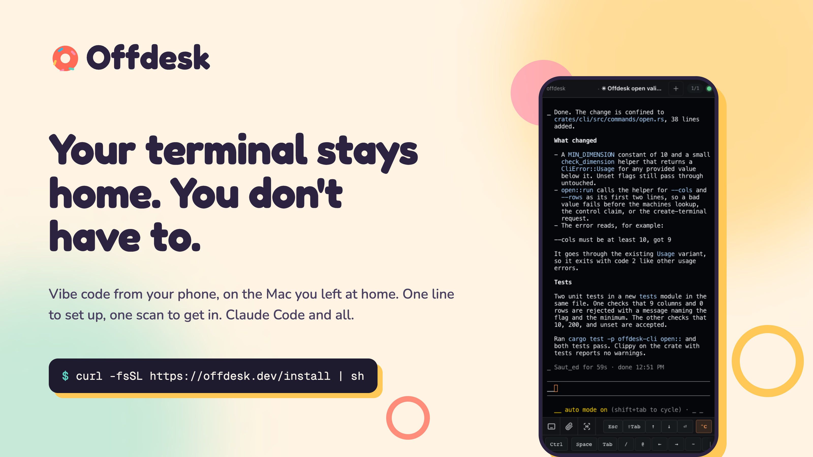

<p align="center">
  <picture>
    <source media="(prefers-color-scheme: dark)" srcset="docs/media/logo-dark.svg">
    
  </picture>
</p>

<!-- The banner is rendered by site/scripts/brand/render.mjs; the phone in it
     is docs/media/phone-terminal.png, a real session. A GIF of the same —
     desk and phone on one terminal, see docs/media/README.md — can take its
     place when someone records one. -->
<p align="center">
  
</p>

Vibe code from your phone, on the terminal you left at home.
One self-hosted hub, every machine you own, any agent that runs in tmux.

Leave the desk and keep your hub awake and online. Your phone opens the same
terminal on that machine, mid-scroll — not a summary of it.

- **0** accounts to create. The hub is yours; the first run prints a link that
  signs you in.
- **1** URL for every machine. A Mac at home, a NAS, a VPS — they all register
  to one hub. The other tools that give you a real terminal run one server per
  machine.
- **3** binaries, nothing else. Rust; the hub is one binary plus a SQLite file.
- **MIT**, including the hub and clients in this repository. Self-hosting needs
  no vendor account. Optional Offdesk Cloud provides managed remote access;
  its service is separate and closed source. Encrypted App connections keep
  terminal content encrypted between your App and Hub.

Questions, setups that did not work, things you want it to do:
[Discord](https://discord.gg/aFUu6VMzc).

## Download

| | | |
|---|---|---|
| **macOS** | [offdesk.dev/mac](https://offdesk.dev/mac) | One dmg for Apple silicon and Intel, signed and notarized. Can be the hub. |
| **Windows** | [offdesk.dev/windows](https://offdesk.dev/windows) | x64 `.msi`. A client. |
| **Linux** | [offdesk.dev/linux](https://offdesk.dev/linux) | x64 `.AppImage`; `.deb` and `.rpm` on [the release page](https://offdesk.dev/desktop). A client. |
| **iPhone / iPad** | [Join TestFlight](https://testflight.apple.com/join/rV4ktaGv) | Use the App for encrypted pairing; a browser can use the Hub sign-in link. |
| **Android** | [offdesk.dev/apk](https://offdesk.dev/apk) | `arm64-v8a`; [`/apk/universal`](https://offdesk.dev/apk/universal) if unsure. |
| **Hub, node, CLI** | `curl -fsSL https://offdesk.dev/install \| sh` | Linux and macOS, x64 and arm64. For a NAS, a VPS, anything without a screen. |

Every link follows the newest release of that kind. Windows is a desktop client;
Linux can also host a Hub with tmux installed separately.

## September release

Hub/CLI/node [0.20.4](https://github.com/zalify/offdesk/releases/tag/v0.20.4),
desktop [0.6.4](https://github.com/zalify/offdesk/releases/tag/desktop-v0.6.4),
and mobile 0.6.6 improve first-time setup, startup reconnection and Android
system-navigation spacing. The Mac app checks that its Hub and machine are ready
before phone pairing, recovers incomplete setup and fixes Chinese punctuation
input. The macOS installer now includes a drag-to-Applications layout.

Direct input, text paste and photo/file attachments remain; local editor was
removed in the previous release. Use the download links above for the latest
published packages. iOS availability is managed through TestFlight and can lag
behind while Apple reviews the build.

## Install

Start with the illustrated Mac setup guide: [English](https://offdesk.dev/docs/mac) ·
[简体中文](https://offdesk.dev/zh/docs/mac). It includes real App screenshots,
phone pairing, first-terminal steps, and the scope of our clean-account testing.

On the machine that stays on — a Mac, a NAS — which is usually also the first
machine you want to reach.

**On a Mac:** download the app from [offdesk.dev/mac](https://offdesk.dev/mac)
(signed and notarized, one dmg for Apple silicon and Intel). Open it and it
asks one question: is this the machine that stays on? Say yes and it installs
the hub, the node and tmux as services that run at login and restart if they
stop, registers this machine, and shows the code your phone scans. The app
stays in the menu bar, where the code, the address and **Add a machine** live.
Say no and it is a client of a hub somewhere else, like the phone.

**On a NAS, a VPS, or anything without a screen:**

```bash
curl -fsSL https://offdesk.dev/install | sh
```

That one line installs the three binaries — the **hub**, the **offdesk-node**
agent, and the **CLI** — into `~/.local/bin` for Linux and macOS on x64 and
arm64, then starts the hub as a service that runs at login and restarts if it
stops, registers this machine with it, and prints a link that signs you in:

```
  offdesk is running at http://192.168.1.10:4317
  data: /Users/you/Library/Application Support/offdesk
  It starts at login and restarts if it stops.

  This machine is registered as "studio" and its node runs as a service
  too, so the first terminal you open is a shell right here.

  Scan this with your phone's camera, or open the link:

    █▀▀▀▀▀█ ▀▄█ ▄ █▀▀▀▀▀█
    …

    http://192.168.1.10:4317/?token=eyJhbGciOi…
```

Scan the code with your phone, or open the link on this machine (it opens in
your browser by itself when you are at the terminal), and you are the hub's
owner, looking at a terminal on this machine. The web UI is inside the
binary; there is nothing else to install and nothing to configure. On a Mac
the hub also keeps the machine from idle-sleeping while it runs
(`--allow-idle-sleep` to opt out; the display and the lid are unaffected).

To see the link and the code again, from any terminal on that machine:

```bash
offdesk-hub link
```

(`offdesk link` does the same once the CLI is set up, and opens a remote
hub's address when there is no hub on this machine.)

The link signs in whoever has it, so keep it off shared terminals. It stops
being printed once you configure GitHub or Google sign-in — which you want the
moment the hub is reachable from outside your network:
[docs/setup-public.md](docs/setup-public.md).

The address in the link is the one a phone on your Wi-Fi can reach; a VPN or
a proxy in TUN mode does not fool it. If it still prints one you cannot reach,
start the hub with `OFFDESK_BASE_URL=http://<this machine's LAN IP>:4317`.

Installer flags: `--no-service` installs the binaries and stops, and the
same `offdesk-hub service install` is then yours to run; `--node-only`,
`--hub-only` and `--cli-only` install one binary; `--prefix <dir>` installs
elsewhere; `--system` uses `/usr/local/bin` (that step, and only that step,
asks for sudo). `offdesk-hub` on its own runs the hub in the foreground, for
Docker and for watching the logs. To build from source instead:
[docs/building.md](docs/building.md).

### Or in Docker

What a NAS usually wants:

```bash
git clone https://github.com/zalify/offdesk && cd offdesk
JWT_SECRET=$(openssl rand -hex 32) docker compose up -d --build
```

That binds `127.0.0.1:4317` and keeps its database in the `offdesk-data`
volume. Set `JWT_SECRET` yourself here — a container that generates one keeps
it in the volume, and losing the volume signs everybody out.

<!-- TODO(ryan): the container workflow already publishes
     ghcr.io/zalify/offdesk-hub on every push to main, but the package is
     private — an anonymous `docker pull` gets 401. Make it public
     (github.com/orgs/zalify/packages -> offdesk-hub -> Package settings ->
     Change visibility) and the clone-and-build above becomes:

       docker run -d --name offdesk-hub -p 4317:4317 \
         -e JWT_SECRET=$(openssl rand -hex 32) \
         -v offdesk-data:/app/data ghcr.io/zalify/offdesk-hub:main -->

## How it works

Three roles. One outbound socket each. Nothing to keep awake but the hub.

1. **Hub** — `offdesk-hub`. One process on the machine that stays on, SQLite
   beside it, the web UI baked in. It knows every machine you own, and it is
   the only address a client ever needs.
2. **Node** — `offdesk-node`, and tmux. On every machine you want to reach,
   the hub's own machine included. It dials out to the hub and keeps one
   WebSocket open, so nothing on it needs an inbound port or a public IP: a
   laptop behind a hotel router and a NAS behind a home NAT both show up in
   one list. Every terminal is a tmux session on the machine that owns it. It
   outlives the app, the network, and you walking away. Uninstall Offdesk,
   ssh in, `tmux attach`, and your sessions are still there.
3. **Client** — anything that talks to the hub. A browser tab, the iPhone or
   Android app, the desktop app, the `offdesk` CLI, another agent on another
   machine. A client never touches a node directly; it asks the hub for a
   machine, and the hub brokers bytes between it and tmux. That is why two
   screens can share one terminal: whoever typed last holds the keyboard,
   everyone else watches live.

```
      clients                   hub                       nodes
  ┌────────────────┐      ┌──────────────┐        ┌──────────────────────┐
  │ browser, phone │      │ offdesk-hub  │        │ offdesk-node         │
  │ desktop app    │◄────►│              │◄──────►│   tmux ── claude     │
  └────────────────┘  WS  │  Axum + WS   │   WS   │   tmux ── vim        │
                          │  SQLite      │        │   tmux ── htop       │
  ┌────────────────┐      │              │        └──────────────────────┘
  │  offdesk CLI   │◄────►│  control     │        ┌──────────────────────┐
  │  another agent │  WS  │  lease       │◄──────►│ offdesk-node (NAS)   │
  └────────────────┘      └──────────────┘   WS   └──────────────────────┘
```

Two screens on one terminal is the same picture twice: the desk's browser and
the phone are both clients of the one hub, attached to the one tmux session.

**Who may type.** The desk and the phone attach to the same tmux session and
see the same bytes. The control lease decides who may type: it is held per
(user, machine), and sending input claims it — last writer wins, no queue.
Everyone else keeps receiving output but their keystrokes, resizes, and image
pastes are dropped: they are watching, live, not disconnected. Reading and
waiting never claim it. The lease is held in memory, so it does not survive a
hub restart. Because tmux runs with `window-size manual`, a phone attaching
never resizes the desk.

### Adding a machine

The machine the hub runs on is registered by the install. For every other
machine you want to reach, open the hub in a browser and choose **Add a machine**
in the machine switcher (a fresh hub with no machine yet lands on that page
by itself). It shows one line, with a token filled in:

```bash
curl -fsSL https://offdesk.dev/install | sh -s -- --hub-url ws://192.168.1.10:4317/ws/machine --token <token>
```

Paste it into a terminal on the new machine. It installs the agent alone,
registers the machine with your hub, and keeps the agent running as a
service — a systemd user service on Linux, a launchd agent on macOS. tmux is
required; the agent checks for it at startup and exits if it is missing.

`<token>` is a registration token: the hub mints one for each new machine,
and it is the only thing tying a node to your hub. You do not type it by
hand; it is on the line the page shows. Each token works once and expires 24
hours after it is issued; generate another for the next machine. The same
line also moves a machine from one hub to another, and re-registers the
machine the hub runs on if the install left it on a hub it already belonged
to.

By hand, the line is `offdesk-node register --hub-url … --token …` followed
by `offdesk-node service install`. Registering restarts an agent service that
is already installed, so the new hub takes effect at once.

`service install` keeps it running across reboots — a systemd user service on
Linux, a launchd agent on macOS. `offdesk-node start` runs it in the
foreground instead.

On macOS, a running node prevents automatic idle system sleep by default so it
stays reachable. The display may still turn off, and closing a laptop lid,
choosing Sleep, or a critically low battery can still put the Mac to sleep. To
opt out, add `"prevent_idle_sleep": false` to
`~/Library/Application Support/offdesk/machine.json`, then restart the node
with `offdesk-node service restart` (or stop and start a foreground node).

## Two setups

The same binaries either way. The only question is whether your phone can
already reach the hub's address.

- **At home, off the desk** — hub on your Mac or NAS, phone on the same Wi-Fi.
  No TLS, no domain. → [docs/setup-lan.md](docs/setup-lan.md)
- **Away from home** — hub on a VPS behind Caddy, at home behind a Cloudflare
  Tunnel, or on your tailnet. The guide compares them by who ends up able to
  read your traffic. → [docs/setup-public.md](docs/setup-public.md)

## On your phone

The browser is the whole client. Open the hub's URL and you are there, on
any phone. A full terminal with a key bar for Ctrl, Esc and the arrows,
because agents ask questions and builds need a Ctrl-C.

Three packaged clients also ship:

- **iPhone / iPad** — join the [public TestFlight beta](https://testflight.apple.com/join/rV4ktaGv).
  Open **Scan QR Code** in the App and scan the Hub's encrypted pairing code.
  Encrypted connections use the App's bundled interface; update through
  TestFlight to receive interface changes. One build works with any hub. Two switches on the
  phone can stand in the way of a hub on the LAN, and the app names them when
  they do: Local Network, and on phones sold in China, Wireless Data. Built
  from `ios-v*` tags.
- **Android** — an APK from [offdesk.dev/apk](https://offdesk.dev/apk), which always
  points at the newest app build (`/apk/universal` for the universal one);
  take `arm64-v8a` on a modern phone, `universal` if unsure. Sideload it; it
  provides in-app update checks, clipboard and encrypted pairing. On first
  launch it scans the code the hub shows — on the terminal at install, under
  the Phone button, or `offdesk-hub link` — and is signed in; one APK works
  with any hub, nothing about a hub is compiled into it. The address can also
  be typed, and the sign-in link pasted.
- **Desktop** — macOS ([offdesk.dev/mac](https://offdesk.dev/mac), signed
  and notarized), Windows ([/windows](https://offdesk.dev/windows)) and Linux
  ([/linux](https://offdesk.dev/linux)), with an auto-updater. On a Mac it can
  be the hub — see Install; on Windows and Linux it is a client, and asks for
  the hub's link. Built from `desktop-v*` tags.

To build any of them yourself: [docs/building.md](docs/building.md).

### Bring your own agent

Offdesk does not wrap an agent or speak its protocol. It hands you the terminal
the agent is already running in, with your own subscription, your own config,
your own dotfiles. Anything that runs in tmux runs here: Claude Code, Codex,
OpenCode, Gemini CLI, Aider, vim, htop, a build that takes an hour. No
agent-specific integration is required for terminal access.

On Linux and macOS, the node also recognizes local Codex session names for
the terminal list, even when Codex only puts the project name in its terminal
title. This needs no Codex configuration change. It reads metadata for the
session held open by that pane's Codex process; if the session cannot be
identified or its metadata is unavailable, the normal terminal title is used.

## For agents

One token, and any agent can drive any machine you own. Any script, or any
agent on any machine, can **open** a terminal on any other machine registered
to your hub, **send** keystrokes into it, **wait** on it, and **read** it
back. Not an agent session: a terminal, so whatever you drive is whatever you
would have run by hand.

```bash
T=$(offdesk open nas --cwd ~/projects/foo --cmd claude --json | jq -r .id)
offdesk send $T "fix the type errors in src/auth.ts; stop when tests pass"
offdesk wait $T --silence 5000 --timeout 600     # or --pattern '❯' to await a prompt
offdesk read $T --lines 80                       # collect the result
offdesk kill $T --yes
```

### Setting up the CLI

The installer already placed it. Create an API token in the web UI (Settings →
API Tokens → Create), then either write it to a config file:

```toml
# ~/.config/offdesk/config.toml  (chmod 600)
# macOS: ~/Library/Application Support/offdesk/config.toml
url   = "https://your-hub.example.com"
token = "odk_..."
```

or export `OFFDESK_URL` and `OFFDESK_TOKEN`. `--url` and `--token` override
both.

### Commands

```
offdesk machines [--all] [--json]               # list machines (default: online; --all includes offline)
offdesk machines rm <id|name> [--yes]           # forget a registered machine
offdesk ls [--machine <id>] [--json]            # list terminals: id, title, group, cwd, size, reachable
offdesk open <machine> --cwd <dir> [--cmd <shell command>] [--group <name>] [--json]
offdesk read <term> [--lines N] [--json]        # capture the current screen as text
offdesk read --all [--machine <id>] [--lines N] [--json] [--concurrency N] [--include-unreachable]
                                                # batch-capture every terminal's screen in one call
offdesk send <term> <text...> [--no-enter]      # type text (Enter appended by default)
offdesk key  <term> <KEY>...                    # Enter Esc Tab BTab Up Down Left Right C-c C-d F1-F12 ...
offdesk wait <term> [--pattern <regex>] [--silence <ms>] [--timeout <sec>]
offdesk kill <term> [--yes]
offdesk link [--no-open]                        # open the hub in a browser; on the hub's machine, the sign-in link + code
```

- Machines and terminals are addressed by **id prefix** (first column of `ls`);
  ambiguous prefixes list candidates.
- Exit codes: `0` success or wait condition met · `1` wait timed out ·
  `2` usage/config/network error. `--json` on every command that prints.
- `--lines N` means "the last N rendered lines of the current screen" (after
  trailing blank lines are trimmed) in both text and JSON mode; JSON also
  reports `lines_total` (pre-slice count) and `truncated`.
- All printed and serialized output is sanitized — control bytes stripped,
  `\n`/`\t` and Unicode kept. Safe to pipe to `jq`.
- `send` types the text, then sends Enter as a **separate delayed frame**
  (150 ms plus 60 ms per newline, capped at 800 ms) so TUI apps that treat
  multi-line bursts as pastes still submit. `--no-enter` sends the text frame
  only.
- `read --all --json` lists **reachable terminals only** by default, with
  `skipped_unreachable_count` at the top level; `--include-unreachable`
  restores their `{"error":"unreachable"}` entries. Each captured entry carries
  `pane_title`, `title_source` (`osc`/`process`/`none`), `foreground_process`
  (`{has_foreground_process, process_name}`, null on lookup failure),
  `activity` (`active`/`quiet`/`idle`) and `idle_ms` — activity is observed
  during the capture window only. `cwd` is live (tmux `pane_current_path`), not
  creation-time.

### Semantics you must know

1. **`send`/`key` claim control** (last-writer-wins). Other clients on the same
   account become view-only until a human reclaims. Read first if a human might
   be typing. The CLI also claims the lease for `open` and `kill`.
2. **`read`/`wait` are pure watchers.** They never claim control and never
   disturb other clients — tmux runs `window-size manual`, so attaching does
   not resize anyone's view.
3. **`read` sees the current screen only**, reconstructed from tmux's attach
   repaint. It cannot see scrollback. For long output, have the agent in the
   session write a file and read that.
4. **Don't poll with repeated `read`** — each call costs an attach, about a
   second. Hold a `wait` for the condition instead.
5. **For an overview of every terminal, use `read --all`.** Do not loop N CLI
   processes over `read`: it is N×(TLS + attach), and a consumer that doesn't
   drain stdout concurrently can deadlock on the pipe buffer.
6. `REACHABLE=no` terminals belong to offline machines and can't be attached.
   `read --all` skips them and reports the count on stderr and as
   `skipped_unreachable_count` in JSON.
7. **A token is remote code execution on every registered machine.** Mint one
   per agent, name it, and revoke it individually when you're done.

## How it compares

The tools that gather several machines into one place hand you a chat; the
ones that hand you a real terminal run one server per machine. Every cell
below is from the vendor's own docs, sourced in the comment under the table.
Checked 2026-09-01; these products move fast, so re-check before relying on
any row.

| | Any terminal program | Machines per hub | Traffic goes through | Agents can drive it via CLI | Self-hosted |
|---|---|---|---|---|---|
| **Offdesk** | Anything that runs in tmux | Any number, one URL | Your own hub | `open` / `send` / `wait` / `read` | Yes, MIT |
| Claude Code Remote Control | No — a Claude Code session, not a terminal | Sessions from several machines in one list | Anthropic's servers; transcript stored there | Not documented | No |
| VibeTunnel | Yes — `vt <any command>`, `vt --shell` | One server per machine | Your choice: LAN, Tailscale, ngrok, Cloudflare | Launches commands only; no send/read/wait against a running session | Yes, MIT |
| Happy Coder | No — wraps `claude` and `codex` | Several; `spawn --machine`, `machines` | slopus cloud by default, end-to-end encrypted | `create` / `send` / `history` / `wait` | Optional, MIT |
| Omnara | Agent sessions; no raw terminal documented | Several at once per agent | `api.omnara.com` by default | CLI and REST: `POST .../inputs`, SSE timeline | Optional, Apache-2.0 |
| Orca | Yes — real terminal, 30+ CLI agents | One server per machine; SSH worktrees reach out from it | Orca Relay by default, or direct on the LAN | `orca terminal create/send/read/wait` | Yes, MIT |

<!-- Sources, checked 2026-09-01.

Offdesk: docs/facts.md in this repo.

Claude Code Remote Control — https://code.claude.com/docs/en/remote-control
  Terminal: it connects claude.ai/code and the Claude app to "a Claude Code
    session running on your machine"; the surface is the conversation.
  Machines: "Open claude.ai/code or the Claude app and find the session by
    name in the session list"; auto-generated names are prefixed with the
    machine hostname.
  Traffic: "it registers with the Anthropic API and polls for work. When you
    connect from another device, the server routes messages between the web or
    mobile client and your local session" and "the session transcript ... is
    stored on Anthropic servers".
  CLI: no CLI for driving a Remote Control session is documented.

VibeTunnel — https://github.com/amantus-ai/vibetunnel
  Terminal: "Run any command in the browser", `vt --shell` for an interactive
    shell. Machines: one Node server per machine; no multi-machine
    orchestration documented. Traffic: README lists Tailscale, ngrok,
    Cloudflare Quick Tunnel, Pinggy, Pangolin, or the local network.
  CLI: `vt` is "a bash script that internally calls `vibetunnel fwd`" and
    launches a new session; the only other verbs are `follow`, `unfollow`,
    `title`. Licence: MIT.

Happy Coder — https://github.com/slopus/happy
  Terminal: "Start using `happy` instead of `claude` or `codex`".
  Machines + CLI: happy-agent provides `machines`, `spawn --machine <id>`,
    `create`, `send`, `history`, `wait` —
    https://github.com/slopus/happy/tree/main/packages/happy-agent
  Traffic: default server is happy-api.slopus.com, end-to-end encrypted;
    self-hosting at https://happy.engineering/docs/guides/self-hosting/
    Licence: MIT.

Omnara — https://github.com/omnara-ai/omnara and https://docs.omnara.com/api/overview
  Terminal: the API is scoped to agent sessions; no raw shell access is
    documented. Machines: "An agent can run with no machines or use several at
    once. These can be sandboxes, your own machines, or both."
  Traffic: "Hosted routes live under: https://api.omnara.com/v1", and
    "Self-hosted deployments serve the same API from their own origin".
  CLI: "Use Omnara programmatically via the CLI, Typescript CLI, or REST API".
  Licence: Apache-2.0.

Orca — https://github.com/stablyai/orca and https://www.onorca.dev/docs
  Terminal: "anything that runs in a terminal will run inside Orca".
  Machines: https://www.onorca.dev/docs/remote-servers — `orca serve` runs
    headless and "agents keep running when the client laptop sleeps or
    disconnects", but "A Remote Orca Server is tied to a single machine ...
    one server cannot reach or manage other machines"; SSH worktrees are how
    it reaches out to another box.
  Traffic: https://www.onorca.dev/docs/mobile — "Prefer Orca Relay for pairing
    when it is available — sign-in is required for Relay only"; LAN pairing is
    the alternative.
  CLI: https://www.onorca.dev/docs/cli/overview — `orca terminal list, read,
    send, wait, create, split`. Licence: "Orca is free and open source under
    the MIT License."
-->

### What the table says

The field splits in two, and the split is not about quality.

**Fan-in, but a conversation.** Claude Code Remote Control, Happy Coder, and
Omnara all let several machines report to one place. What you get there is an
agent session, not a terminal — which is the right trade if the agent is all
you wanted.

**A real terminal, but one server per machine.** VibeTunnel and Orca both give
you a genuine terminal. Both run one server per machine: VibeTunnel by design,
Orca because a Remote Orca Server is tied to a single host and reaches other
boxes over SSH.

Offdesk is the combination: walk away from any machine you own and pick up the
real terminal from your phone, through a server you run. Each of the five drops
one of those three — the agent, the machine, or the server.

That is the only claim this table supports, and it is narrower than "better".
If you want parallel git worktrees, diff review, and a browser and emulator
harness around your agents, **Orca** does far more than Offdesk and is also
MIT. If you want one machine's terminal in a browser with the least possible
setup, **VibeTunnel** is a smaller thing to run. If you only ever drive Claude
Code and want zero setup, **Remote Control** is already in your CLI.

## Security

**A token is remote code execution on every registered machine.** It opens
terminals and types into them, and a terminal runs whatever your shell runs.
Treat one like an SSH key, not an API key.

What the hub gives you to contain that:

- **One token per agent.** Every token has a name you choose at creation.
- **Individual revoke.** Deleting one token does not touch the others.
- **Last used.** Every token records the last time it authenticated, so you can
  tell which ones are live.
- Tokens are stored as SHA-256 hashes. The plaintext is shown once, at
  creation, and is not recoverable.

The sign-in link the hub prints signs in whoever has it; treat it like a
password. The control lease is not a security boundary, and it does not stop
anyone holding a valid token.

Threat model, what the control lease does and does not prevent, and what the
hub keeps in SQLite: [SECURITY.md](SECURITY.md).

## Questions, answered

**Do I need an account?** Self-hosting needs no vendor account: installation
creates a local user and a sign-in link. Optional Offdesk Cloud uses a separate
sign-in for managed remote access.

**Does my traffic go through offdesk.dev?** Direct LAN connections go to your
Hub. Optional Offdesk Cloud routes encrypted App traffic through a managed
address under `*.cloud.offdesk.dev`. A self-managed tunnel uses its provider.
[Encrypted pairing](docs/encrypted-connections.md) protects terminal content
between the App and Hub; an ordinary browser sign-in link is a different mode.

**Is it only for Claude Code?** It is a terminal. Claude Code, Codex, OpenCode,
a build that takes an hour, or vim — whatever runs in tmux runs here, and
Offdesk does not know or care which.

**What about iPhone?** There is an app, on TestFlight for now — see
[On your phone](#on-your-phone). Without it, the browser is the whole client:
scan the hub's code with the camera, and add the page to the home screen.
Android has an app too. Use the in-app scanner for encrypted pairing codes;
use the ordinary sign-in link when connecting through a browser.

**What if two people type at once?** The control lease decides who may type.
Sending input claims it — last writer wins, no queue. Everyone else keeps
receiving output, so they watch live instead of being disconnected.

## Community

[Discord](https://discord.gg/aFUu6VMzc) for questions and setups; GitHub
[issues](https://github.com/zalify/offdesk/issues) for bugs.

## License

The code in this repository is MIT. See [LICENSE](LICENSE). The optional
Offdesk Cloud service is maintained separately and is not included here.
