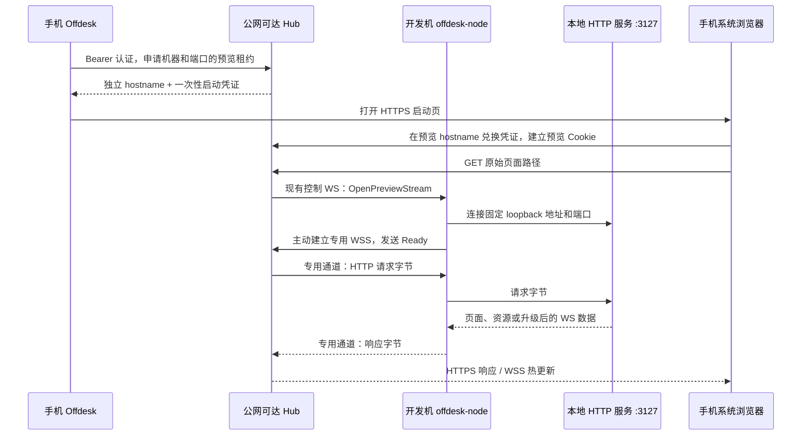

# Offdesk 手机远程本地预览设计

日期：2026-09-05。本文保留原始设计提案；2026-09-08 已在 PR #406 实现并适配 main 0.20.4。当前配置、限额、手机入口和加密边界以 [web-previews.md](../web-previews.md) 为准；公网 DNS/TLS 部署与实体手机外网验收仍未执行。原始设计状态：研究与建议设计。代码依据为刷新后的 `origin/main`：`c1e5d35fdeaf512697d2245a45d613eec6064ca4`（0.19.2）。本文的接口、协议、默认限额和配置名均为拟议值。

## 目标与推荐

手机使用移动网络时，点击 Offdesk 终端中的 `http://localhost:3127/customization/custom-heavyweight-hoodie-manufacturer`，在系统浏览器看到开发机上真实运行的页面，保留路由、资源、表单/API 和热更新。开发机只需运行新版 offdesk-node 并能连到 Hub；无需安装手机 VPN、逐端口启动第三方隧道或开放家用路由器入站。

采用 **Hub HTTP 反向代理 + 节点主动连接的独立数据 WebSocket**。已有 machine WebSocket 只发建立通道的控制命令；网页字节不进入终端输出队列。每个预览租约分配独立 HTTPS hostname，使用短期预览会话 Cookie。第一版为个人私有预览，网页自身的写操作仍然可能生效，不应称为只读模式。



前提是 Hub 本身能从外网访问，开发机和 Hub 保持开机联网；休眠或断网时页面服务不可用。本轮没有核验 NAS 当前公网入口和 DNS/TLS 状态，不把仓库中的 Tunnel 示例当成实际部署证据。

## 已有代码可复用什么

下面链接固定到上述 revision，避免本地分支后续漂移。

| 证据 | 结论与改动位置 |
| --- | --- |
| [节点连接与注册](https://github.com/zalify/offdesk/blob/c1e5d35fdeaf512697d2245a45d613eec6064ca4/crates/machine/src/hub_conn.rs#L106) | 节点已主动连 Hub，注册包含 capabilities。新增 `preview-tcp-v1` 能力和控制命令即可通知节点，旧节点继续可用。 |
| [HubToMachine](https://github.com/zalify/offdesk/blob/c1e5d35fdeaf512697d2245a45d613eec6064ca4/crates/protocol/src/lib.rs#L274) | 当前没有网页代理协议，不能仅改链接地址就实现。 |
| [终端拥塞处理](https://github.com/zalify/offdesk/blob/c1e5d35fdeaf512697d2245a45d613eec6064ca4/crates/hub/src/ws.rs#L779) | 未压缩终端输出可在队列满时丢弃再重绘，压缩流则断开；网页流不能复用这套投递语义。 |
| [机器访问校验](https://github.com/zalify/offdesk/blob/c1e5d35fdeaf512697d2245a45d613eec6064ca4/crates/hub/src/machine_manager.rs#L452) | 创建租约复用用户对机器的访问校验；每条新流重新校验权限和能力并绑定当次节点连接 conn_id。节点重连关闭旧流但保留租约，防止重连串流。 |
| [AuthUser](https://github.com/zalify/offdesk/blob/c1e5d35fdeaf512697d2245a45d613eec6064ca4/crates/hub/src/auth.rs#L194)、[前端 API](https://github.com/zalify/offdesk/blob/c1e5d35fdeaf512697d2245a45d613eec6064ca4/packages/app/lib/api.ts#L19) | 管理 API 使用 Bearer。外部浏览器不应依赖原生 App 的登录存储，也不能获得完整 Hub token。 |
| [TerminalViewProps](https://github.com/zalify/offdesk/blob/c1e5d35fdeaf512697d2245a45d613eec6064ca4/packages/app/components/TerminalView.types.ts#L41)、[链接激活](https://github.com/zalify/offdesk/blob/c1e5d35fdeaf512697d2245a45d613eec6064ca4/packages/app/components/TerminalView.xterm.tsx#L783) | 已有 machineId/terminalId；OSC 8、普通链接和触摸路径需要汇入同一个有机器上下文的处理函数。 |
| [Hub router 装配](https://github.com/zalify/offdesk/blob/c1e5d35fdeaf512697d2245a45d613eec6064ca4/crates/hub/src/main.rs#L358) | 目前 /api、/ws、UI fallback 和 permissive CORS 在一起。预览必须先按 hostname 分流，不能直接挂入现有全局路由。 |

仓库的 `terminal-previews` 是终端缩略图，不是网页预览。新模块用 `web_preview` 命名以免混淆。

## 传输：独立连接，先不做复杂多路复用

比较结果：在现有 machine WS 中塞网页帧会共享拥塞与顺序；增加单条复用 preview WS 则需要自行实现流窗口、公平调度和每流取消。第一版选每条上游 TCP 连接一条独立反向 WS，先不池化，每个 HTTP 请求或长期 WS 升级占一条。连接建立成本较高，但流的背压、取消和终端隔离更容易验证。后续根据实测再加按租约池化，不能跨用户或租约混用连接。

拟议控制消息：

```text
OpenPreviewStream {
  stream_id, ticket, port, address_family, expires_at
}
```

流程与约束：

1. Hub 先登记 pending stream（绑定 lease/user/machine/conn_id/port/期限），再发送命令，避免节点快速回连时找不到请求。
2. 节点仅在当前已认证控制连接内接受命令，连接 `127.0.0.1:port` 或显式选择的 `[::1]:port`。命令不允许任意 URL、DNS 名称或 Unix socket。默认 IPv4；IPv6 loopback 单独选择，不能把失败回退变成 LAN 探测。
3. 节点根据自己的已配置 Hub origin 构造固定 `/ws/preview-stream/{stream_id}`，在握手 Authorization 中使用短期、单次 ticket。不得由控制消息任意指定数据通道的远程地址，也不把 machine_secret 放进 URL。
4. Hub 校验并原子消费 ticket，核对连接代次及租约仍有效。节点连接 loopback 成功后发送 Ready；失败发送分类 Error。Ready 前 Hub 不向浏览器提交成功状态。
5. 独立 WS 的 Binary 承载原始 TCP 字节，Text 仅承担 Ready/Error/方向性 EOF 等控制。实现一个有界 `AsyncRead + AsyncWrite` 适配器；WS 消息边界不等于 HTTP 消息边界。Ping/Pong 不进入字节流；单向 shutdown 使用 EOF 帧，不能提前关闭另一方向。错误必须终止流，绝不丢弃字节后继续。
6. Hub 使用 Hyper HTTP/1.1 client handshake 在此流上发送请求，流式返回 body；HTTP 和 WS 的头处理统一留在 Hub，节点只处理固定 loopback TCP。对于合法 WebSocket 请求，等待上游 101 并验证握手后，在 Hyper 客户端和浏览器两侧取得 upgraded IO，双向转发。非 101 错误按正常 HTTP 返回。禁止 CONNECT、任意协议 Upgrade 和原始公网 TCP 接入。

技术依据：[Hyper client guide](https://hyper.rs/guides/1/client/basic/) 允许传入 IO；本机 Cargo.lock 为 Hyper 1.9.0，已阅读该版本 `src/client/conn/http1.rs` 的 `handshake`/`with_upgrades` 及 `src/upgrade.rs` 的客户端与服务端升级要求。Hub 需显式添加 hyper、hyper-util、http-body-util 所需 features，不能依赖当前的间接依赖。具体 adapter、流生命周期和 upgrade 桥接仍需第一阶段代码验证，本文没有声称已跑通。

初始可配置预算建议：每机器最多 32 条活跃数据连接、每用户 64 条；pending 有界排队 5 秒后拒绝；WS 数据块上限 64 KiB，单流每方向最多 256 KiB 等待缓冲。连接/Ready 10 秒、首响应头 60 秒。SSE/WS 不使用短的整请求超时，改用心跳、连接存活和租约期限。限额是设计起点，需测 Next.js 冷编译与大文件后的终端延迟。

普通 HTTP 响应的 body/trailers 完成后，第一版主动关闭该 Hyper 上游连接、反向 WS 并释放配额，不能等待开发服务器 keep-alive EOF；否则一页资源就可能占满连接限额。SSE 持续到响应结束，101 升级持续到 WS 关闭、失联或租约撤销/到期。

浏览器取消时立即释放上游和 pending；绝不自动重试可能已经执行的 POST。节点控制连接断开或换代时取消其全部数据流及租约，旧 ticket 回连拒绝。拒绝连接、等待超时、节点离线、租约过期分别用 502/504/503/401 等可辨别状态；升级后只能关闭 WS，不能再伪造 HTTP 错误。控制命令入队也要有超时，避免无限等待。

## 预览租约与登录交接

管理接口仅放在 Hub 控制域名，均使用现有 AuthUser：

| 拟议接口 | 行为 |
| --- | --- |
| `POST /api/machines/{machine_id}/web-previews` | 接收 port、address_family（ipv4/ipv6，默认 ipv4）、可选 terminal_id、原始 path/query/fragment。校验归属、在线、能力、端口和路径，创建新租约并返回 launch_url、expires_at。family 同时保存到 lease/pending，点击 [::1] 必须选择 ipv6。 |
| `GET /api/web-previews` | 仅列本人有效租约及机器、端口、期限，便于关闭。 |
| `DELETE /api/web-previews/{id}` | 撤销租约、会话、pending 和所有数据连接。 |

第一版租约放 Hub 内存，不新增持久化表：Hub 重启后重新打开预览即可。建议租约硬期限 2 小时、启动码 60 秒，均可配置。每次新授权使用不可预测、永不重新分配的随机 hostname；不把 machineId、目录名、端口直接编码进公开域名。过期后的新打开生成新 hostname，防止旧预览的 service worker 截获新的认证启动页。浏览器已有当前租约 Cookie 时可刷新同一地址；跨浏览器或重新认证生成新租约。

启动流程：App 持有 Hub Bearer 调管理 API → 系统浏览器打开 `https://p-<random>.<preview-zone>/__offdesk_preview__/bootstrap#code=<one-time>` → Hub 自有极简启动页先用 `history.replaceState` 清理 fragment，再以同源 fetch JSON POST 兑换 → Hub 原子消费码并设置 `__Host-offdesk-preview`（Secure、HttpOnly、Path=/、无 Domain、SameSite=Lax）→ `location.replace` 到绑定的原始路径。码只授权该租约，不换取 Hub JWT。

启动页使用 no-store、no-referrer、严格 CSP、无第三方脚本；兑换要求准确 Origin。Cookie 与 ticket 只存散列。目标路径必须在当前预览 origin 内，拒绝绝对 URL、`//host`、userinfo 等开放重定向形式；fragment 只用于最终浏览器定位，不发给本地 HTTP 服务。保留 `/__offdesk_preview__/` 为系统路径，因此上游同名路径第一版不支持。独立启动页也支持初始目标为 PDF 或下载。

重要隔离规则：

- 按 Host 严格分流：控制 hostname 才可进入 Hub /api、/ws 和 SPA；预览 hostname 的 `/api`、`/ws` 属于上游应用。未知 Host 直接拒绝。不可不加验证地信任 X-Forwarded-Host；反代必须保留外部 Host。
- 预览数据入口每个 HTTP 请求、WS 握手都检查租约、会话、机器归属及期限；到期/撤销主动关闭已有长期连接。公网预览不继承 dev_mode 的免认证行为。
- 不向上游发送预览 Cookie、ticket 或 Hub Bearer。上游应用自己的 Authorization/Cookie 按代理规则保留；不能笼统删除所有应用认证。
- 过滤上游试图写入预览保留名的 Set-Cookie；重复认证 Cookie 拒绝。上游普通 Cookie 去除 Domain 后成为该预览的 host-only Cookie，保留合法其他属性；跨域登录 Cookie 第一版不保证兼容。
- 去除响应中的 Domain 无法阻止应用 JavaScript 自行向母域写普通 Cookie。因此 `__Host-` 预览凭证可隔离，但不能承诺兄弟预览的任意应用 Cookie 完全隔离。优先使用与控制台不同的注册域，控制台保持 Bearer 认证，不把母域 Cookie 当作身份；更强的跨应用存储隔离需单独设计。
- 不继承 Hub 的 permissive CORS。兄弟预览虽然不同 origin，仍可能 same-site：对写请求和 WS 校验准确 Origin，拒绝 null；普通请求检查 Fetch Metadata，阻止其他预览嵌入或跨源 fetch。允许合法顶层进入预览，但不能把缺少 Origin 普遍当作可信。缺 Fetch Metadata 的兼容策略须显式限定并验证，不放开所有来源。
- Hub/入口不共享缓存私有预览内容，配置 no-store 并禁用对应 CDN 缓存。首次发布测试缓存命中不能绕过认证。预览过期后无法撤回已下载或被上游 service worker 缓存的内容，不能宣称远程清除。

浏览器官方依据及细节见 [浏览器约束附录](2026-09-05-preview-browser-constraints.md)。这些是本功能必需的认证边界，不是额外的用户确认流程。

## HTTP 兼容边界与当前 Next.js 场景

公网端保留原始路径及 query，不插入 `/preview/{id}` 前缀；上游连接走 loopback，但默认保持外部预览 Host 与真实 Origin 一致，重建可信 Forwarded/X-Forwarded-*。不为规避开发服务器保护而无条件伪造 localhost Origin。若开发服务器要求配置域名，提供准确的开发配置提示。

代理须流式处理 GET/HEAD/POST 等方法、二进制文件、Range/206、重复 Set-Cookie、SSE、重定向与 WebSocket 子协议。HTTP 普通连接逐跳头及 Connection 指定的头应正确移除；WS 升级单独处理必要头并验证上游握手，不能仅看到 101 就开始任意字节转发。不做整个 body 缓冲、Base64 编码、HTML/JS 全文替换或自动跟随上游重定向。仅将指向同一已授权 loopback 端口的 Location/Refresh 重写到该预览域名；其他外部跳转保持浏览器语义，绝不在 Hub 代为请求。

若 JavaScript 写死 `http://localhost:8000`、使用另一个 WS 端口或外部 OAuth 固定回调，代理单个端口无法自动修正。第一版支持一个端口、HTTP loopback 上游；本地自签 HTTPS、跨端口编排、任意 TCP、公开分享和自动端口扫描延后。

截图服务只读核验结果：`:3127` 的进程 cwd 是 Tradebase 的 `feat-jiashun-landing-evidence-layout/apps/storefront-jiashun`；该目录安装 Next **15.5.15**。`next.config.ts` 没有 allowedDevOrigins，并设置 `X-Frame-Options: SAMEORIGIN`，因此首选系统浏览器而不是跨域 iframe。

已阅读其实际安装的 `next/dist/server/lib/router-utils/block-cross-site.js`：15.5.15 未设置 allowedDevOrigins 时为 warn 模式；显式设置后为 block 模式。最新 [Next.js allowedDevOrigins 文档](https://nextjs.org/docs/app/api-reference/config/next-config-js/allowedDevOrigins) 描述的是新版默认阻止，不能倒推当前版本行为。实现时按实际版本配置受控预览 hostname/专用域名范围，验证 `/_next/` 资源、Turbopack 热更新与 Server Actions；Host、Origin、X-Forwarded-Host 必须一致。本文未修改 Tradebase 配置或服务。

## 手机交互与前端接入

第一版提供终端工具菜单「打开预览」，默认从当前终端得到机器，用户填端口和路径；同时将链接点击中的精确 loopback HTTP URL（localhost、127.0.0.1、[::1]）导入同一流程。`0.0.0.0` 仅作为开发服务器常见显示地址显式归一为 IPv4 loopback；不识别任意 `*.localhost`、userinfo、非 HTTP 协议或文本子串。只在用户点击时申请，不扫描输出并自动暴露端口。

前端处理放到带 machineId 的上下文，普通公网链接仍走现有 opener。OSC 8、WebLinksAddon、触摸激活统一去重，API 请求期间也锁定，避免一个点击创建多个租约。

原生 App 可先异步申请租约，再调用已有 Tauri opener 打开 HTTPS。普通 Web 浏览器要避免等待 fetch 后被 popup blocker 拦截：在点击同步阶段打开 Hub 同源的受信 launcher 页面（只携带目标参数，不带 token），由该页使用浏览器现有 Hub 登录状态申请租约并跳转。若不能打开新窗口，展示明确的可点击打开入口。过期码重试重新申请；诊断/Toast/日志不复制或记录启动码 URL，避免沿用当前链接失败时直接复制完整 URL 的行为。

第一版不要求新增原生插件，但仍必须在当前 Android 包实际验证外部打开与返回 App；新 Hub 前端能否直接复用旧壳，不能仅凭浏览器测试判定。

## 一次性基础设施配置

新增拟议 `OFFDESK_PREVIEW_DOMAIN`，不配置则 UI 展示预览未配置。需要 wildcard DNS、匹配层级的 HTTPS 证书、以及把这些 Host 的 HTTP/WS 请求转发到 Hub 的入口规则。域名仅为设计占位，尚未选择或配置真实名称。

Cloudflare full-zone 普通 Universal SSL 默认覆盖 zone 根和一级子域，因此 `p-<random>.example.com` 与 `p-<random>.preview.example.com` 不能假设共用证书覆盖；后一种需适当证书或独立 zone。优先专用预览域，若与 Hub 使用同一注册域，必须严格执行上述 same-site 与 Cookie 隔离。入口使用固定 Host 规则把预览发给 Hub，不能将 Host 重写成 server:4317；禁止透传客户端伪造的转发头。相关官方说明见附录。

复用已有公网可达 Hub 所在入口即可，不要求再购买独立转发服务器，但需要新增域名路由/证书能力。若入口有认证中间层、WAF、超时或响应缓冲，要验证新 machine 数据 WS、浏览器 HMR 和 SSE 都能通过。当前生产入口配置、证书覆盖与缓存规则留待实施时只读核验。

## 实施顺序与验收

1. **传输基础与认证边界**：新增协议 capability、节点 PreviewTransport、Hub PreviewRegistry/Host dispatcher、ticket 及流取消；在隔离测试网络验证 HTTP body 与 WebSocket 升级。先把无丢字节、内存有界和旧节点兼容跑通。
2. **浏览器可用闭环**：租约/启动页/Cookie/撤销/Origin 与 header 规则；手机工具菜单和 loopback 点击；接入真实 Next 15.5.15 页面及一个 Vite fixture，覆盖框架域名配置。
3. **入口配置与发布验证**：配置预览 DNS/TLS/反代，发布匹配的 Hub 和 node，验收 Android 关闭 Wi-Fi 用移动数据打开页面、导航、改代码自动更新并返回终端。最后验证大文件期间终端输入延迟及机器断线表现。

建议代码落点：`crates/protocol/src/preview.rs`（控制类型/数据通道协议）、`crates/machine/src/preview.rs`（loopback 和独立 WS）、`crates/hub/src/web_preview/{registry,transport,proxy,auth}.rs`、`routes/web_previews.rs`、`packages/app/lib/webPreview.ts` 和终端工具菜单；公共 DTO 同步 `packages/shared`。保持终端 attach router 不承担 HTTP 数据。

发布门槛包括：

- HTTP 流无损、上传/下载取消、Range/HEAD、302、应用 Cookie、SSE 首块及时到达；WS text/binary/subprotocol/close 正确，非 101 上游失败不被吞掉。
- 无凭证、跨用户/机器、过期/重复 ticket、错误 conn_id、保留 Cookie 覆写、兄弟预览 CSRF、预览 Host 访问 Hub API、缓存绕过、旧 service worker 与 hostname 重用均有拒绝用例。
- 节点离线/重连、Hub 重启、终端退出与服务退出、租约到期/撤销、大响应慢客户端：资源释放、错误可理解，终端连接继续工作。终端退出不必立即关闭预览，因为开发服务可能独立存活；机器断线和显式撤销必须关闭。
- 旧节点不声明 capability 时显示「需要更新此机器节点」，不得发未知命令后无限等待。新节点连接旧 Hub 时没有预览命令也保持终端正常。
- 按仓库要求使用 `pnpm e2e:test`/`pnpm e2e:ci` 的容器浏览器执行常规 E2E；不同 hostname 的测试不能只换 URL 路径模拟。真实 Android/移动网络、外部浏览器认证交接和公网证书仍是单独验收项。

本次交付为研究文档及代码/官方资料核验，未运行尚不存在的功能测试。工作分支：`docs/mobile-preview-design`。实施前剩余环境事实为预览域名及其 DNS/TLS 入口；其余架构选择已经在本文给出默认方案，无需用户逐项做技术选择。
